# Hallucination to Truth: A Review of Fact-Checking and Factuality Evaluation in Large Language Models


[](https://arxiv.org/abs/2508.03860)

<div align="center">
  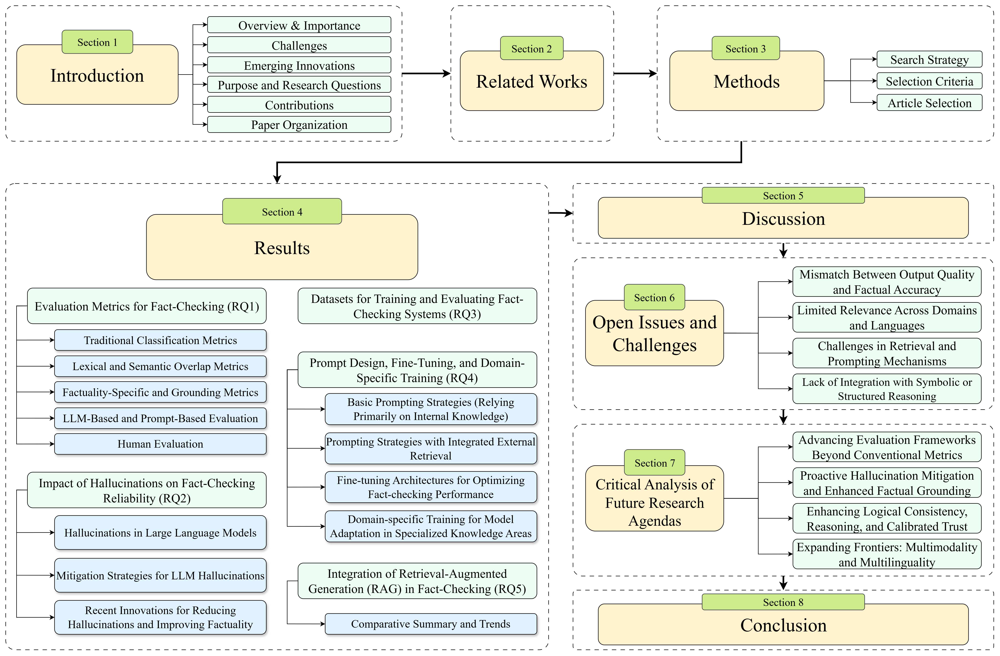
</div>
<p align="center"><em>Figure 1: The fundamental content structure and categorization of this survey.</em></p>

## 📋 Abstruct

Large Language Models (LLMs) are trained on vast and diverse internet corpora that often include inaccurate or misleading content. Consequently, LLMs can generate misinformation, making robust fact-checking essential. This review systematically analyzes how LLM-generated content is evaluated for factual accuracy by exploring key challenges such as hallucinations, dataset limitations, and the reliability of evaluation metrics. The review emphasizes the need for strong fact-checking frameworks that integrate advanced prompting strategies, domain-specific fine-tuning, and retrieval-augmented generation (RAG) methods. It proposes five research questions that guide the analysis of the recent literature from 2020 to 2025, focusing on evaluation methods and mitigation techniques. Instruction tuning, multi-agent reasoning, and RAG frameworks for external knowledge access are also reviewed. The key findings demonstrate the limitations of current metrics, the importance of validated external evidence, and the improvement of factual consistency through domain-specific customization. The
review underlines the importance of building more accurate, understandable, and context-aware for fact-checking. These insights contribute to the advancement of research toward more trustworthy models.

**Authors:**  
Subhey Sadi Rahman¹, Md. Adnanul Islam¹, Md. Mahbub Alam¹, Musarrat Zeba¹, Md. Abdur Rahman¹, Sadia Sultana Chowa², Mohaimenul Azam Khan Raiaan¹,³, Sami Azam³,*  

¹ *Department of Computer Science and Engineering, United International University, Bangladesh*  
² *Department of Computer Science and Engineering, Daffodil International University, Bangladesh*  
³ *Faculty of Science and Technology, Charles Darwin University, Australia*

---

## 📊 Key Figures

### Creening process and inclusion and exclusion criteria
<div align="center">
  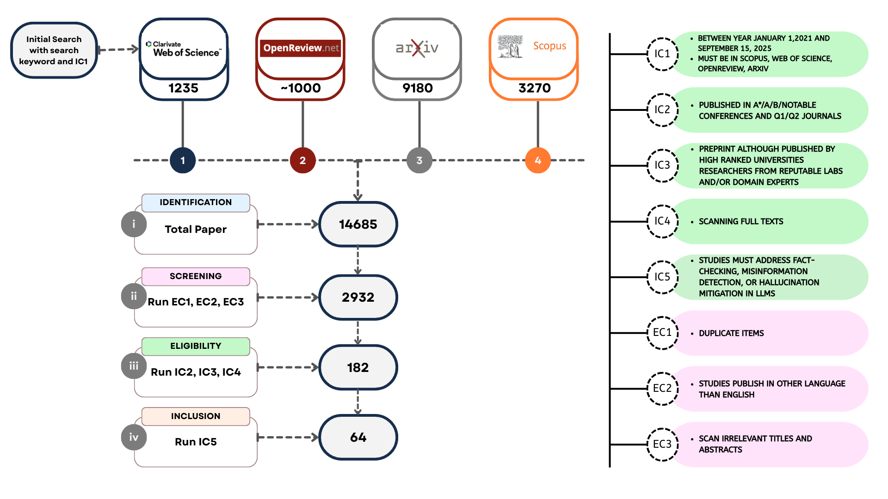
</div>
<p align="center"><em>Figure 2: The article selection and screening process is on the left and inclusion and exclusion criteria for article selection
is on the right.</em></p>

### Article Selected Venues
<div align="center">
  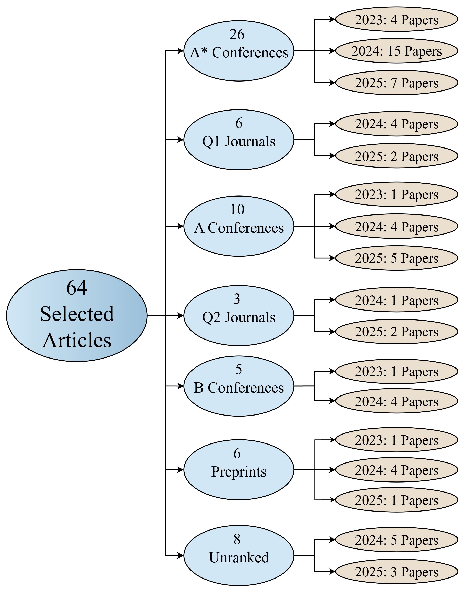
</div>
<p align="center"><em>Figure 3: A visual summary of the articles selected from journals, conference proceedings, and preprints.</em></p>

### Publication Timeline
<div align="center">
  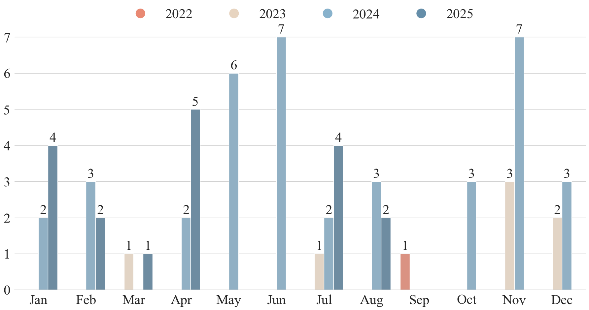
</div>
<p align="center"><em>Figure 4: Grouped bar chart showing the monthly break-down of publications from 2021 to 2025.</em></p>

### Publication Country
<div align="center">
  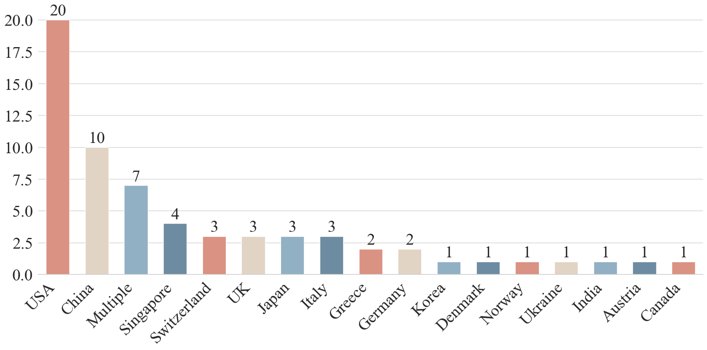
</div>
<p align="center"><em>Figure 5: Bar chart illustrating the geographical breakdown of publications.</em></p>

### Evaluation Metrics Taxonomy
<div align="center">
  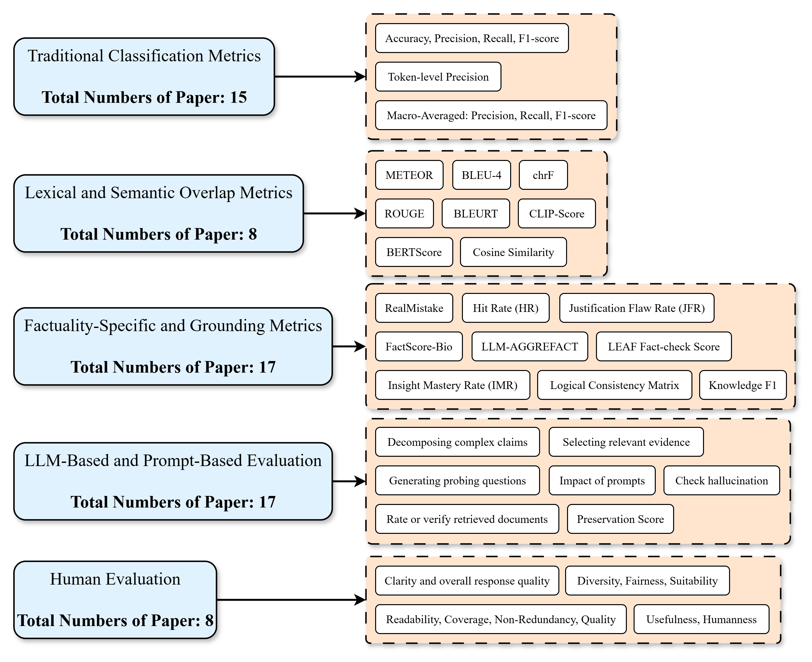
</div>
<p align="center"><em>Figure 6: Taxonomy of evaluation metrics for fact-checking systems</em></p>

### Dataset Overview
<div align="center">
  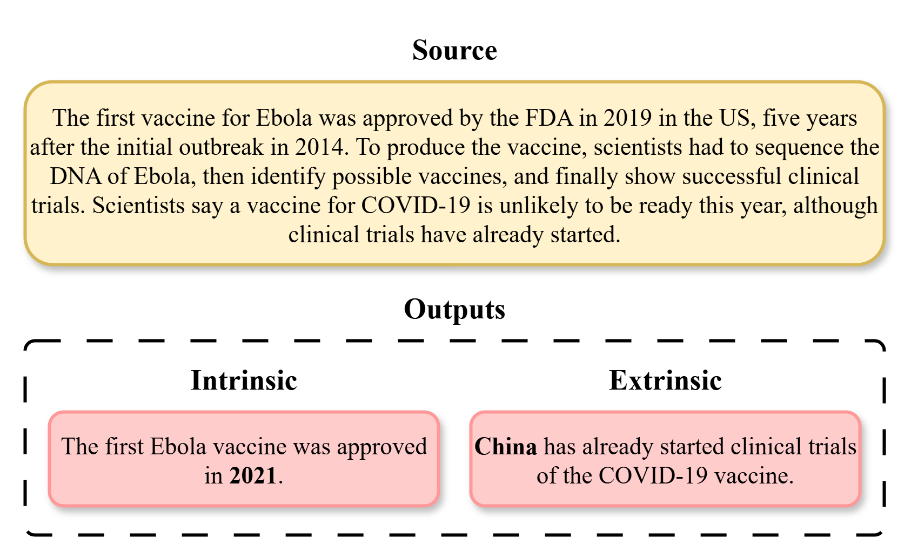
</div>
<p align="center"><em>Figure 7: Intrinsic vs. extrinsic hallucinations in LLM out-puts: The source text provides verifiable ground truth about
Ebola and COVID-19 vaccines. The intrinsic hallucination
example contradicts the fact explicitly stated in the source,
whereas extrinsic hallucination introduces new information
that is not supported by the source.</em></p>

### RAG System Workflow
<div align="center">
  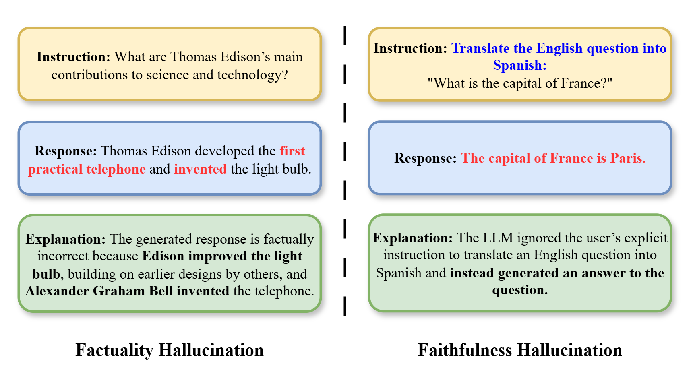
</div>
<p align="center"><em>Figure 8: Two types of hallucination: Red-highlighted textshows hallucinated content, while blue-highlighted text re-flects user instructions or context that conflict with the hal-
lucination.</em></p>

### RAG System Workflow
<div align="center">
  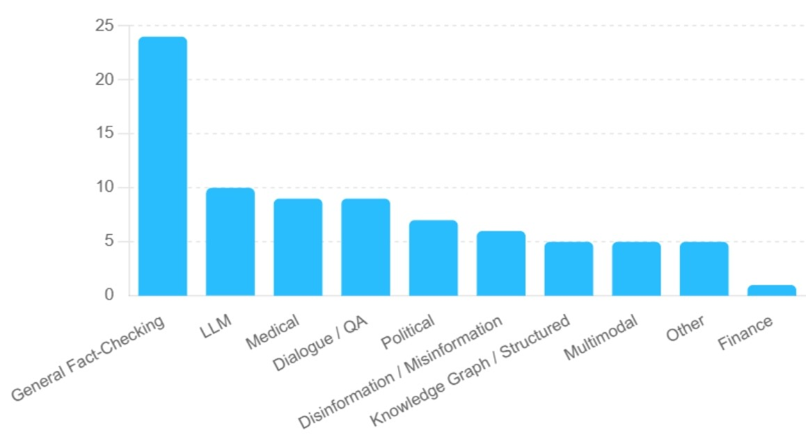
</div>
<p align="center"><em>Figure 9: Illustration of major dataset types and domains.</em></p>

### RAG System Workflow
<div align="center">
  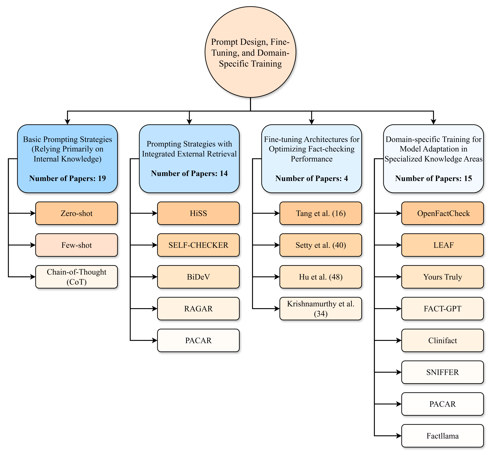
</div>
<p align="center"><em>Figure 10: Breakdown of approaches in prompt design, fine-tuning, and domain-specific training.</em></p>

### RAG System Workflow
<div align="center">
  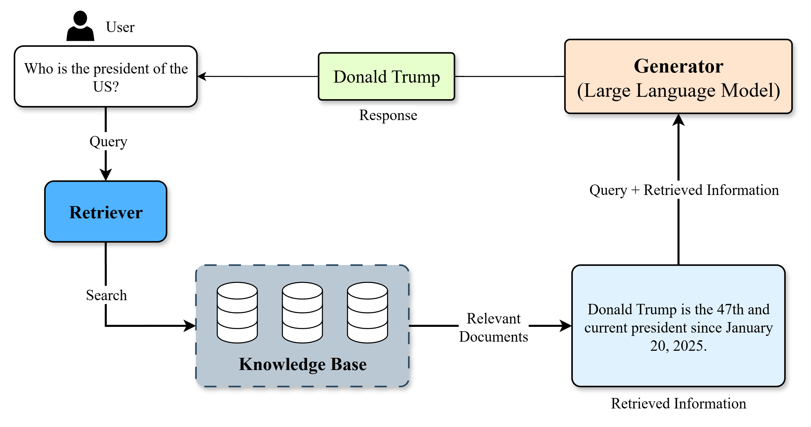
</div>
<p align="center"><em>Figure 11: Workflow of a RAG system for factual question answering.</em></p>

### RAG System Workflow
<div align="center">
  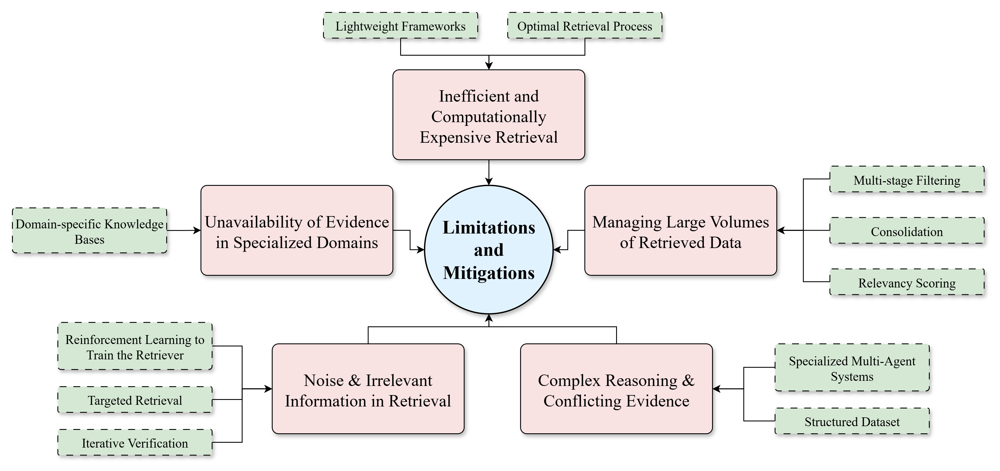
</div>
<p align="center"><em>Figure 12: Limitations in RAG-based fact-checking and corresponding mitigation Strategies</em></p>

---

## 📑 Research Questions

- **RQ1:** What evaluation metrics are used to assess LLM-based fact-checking systems?
- **RQ2:** How do hallucinations affect the reliability of LLM fact-checking?
- **RQ3:** What datasets are commonly used for training and evaluating fact-checking models?
- **RQ4:** How do prompting strategies and fine-tuning influence fact-checking performance?
- **RQ5:** How is RAG integrated into fact-checking?

---

## 📈 Key Statistics

| Statistic | Value |
|-----------|-------|
| **Papers Reviewed** | 55 (from initial pool of 14,685) |
| **Review Period** | January 2020 - September 2025 |
| **Datasets Analyzed** | 72 |
| **Databases Searched** | Web of Science, arXiv, Scopus, OpenReview |

---

## 📁 Repository Contents

```
├── 📄 README.md                     # This file
├── 📑 LLM_Fact_check_R1_Highlighted.pdf  # Full paper
├── 📊 data/
│   ├── Scopus.pdf                  # Database search results
│   ├── Web_of_Science.pdf          # Database search results
│   └── ArXiv.pdf                   # Database search results
├── 🖼️ figures/                      # All paper figures
├── 📋 tables/                       # Supplementary tables
└── 📚 references/                   # Additional resources
```

---

## 🔍 Main Findings

### 📏 Evaluation Metrics
- Transition from traditional classification metrics to sophisticated, context-aware frameworks
- Rise of benchmarks like **LLM-AGGREFACT** and **AVERITEC**
- Need for standardized metrics for explainability and logical integrity

### 🧠 Hallucination Mitigation
- **RAG** as foundational strategy for grounding LLM responses
- Multi-agent systems showing promise (**LoCal**, **PACAR** frameworks)
- Domain-specific fine-tuning outperforming general models in specialized areas

### 📊 Datasets
- 72 key datasets identified for fact-checking research
- 63 datasets use **RAG**, 48 used for hallucination reduction
- Growing need for multilingual and multimodal datasets

---

## 📊 Summary Tables

| Paper | Metrics & Gaps | Hallucination | Datasets | Prompt/Fine-tuning | RAG & Domain |
|-------|----------------|---------------|----------|---------------------|---------------|
| Vykopal et al. [23] | ❌ | ✅ | ❌ | ✅ | ❌ |
| Dmonte et al. [24] | ✅ | ✅ | ✅ | ✅ | ❌ |
| Augenstein et al. [3] | ✅ | ✅ | ✅ | ✅ | ❌ |
| Wang et al. [25] | ✅ | ✅ | ✅ | ✅ | ❌ |
| **Our Work** | ✅ | ✅ | ✅ | ✅ | ✅ |

<p align="center"><em>Table 1: Comparison with Existing Surveys</em></p>

---

## 🚀 Future Research Directions

### 🔬 Evaluation Framework Advancement
- Multi-dimensional frameworks beyond binary accuracy
- Dynamic evaluation suites for evolving misinformation

### 🛡️ Factual Hallucination Mitigation
- Proactive prevention mechanisms
- Optimized RAG systems for complex information environments

### 🧩 Logical Consistency & Reasoning
- Formal verification methods
- Enhanced multi-hop reasoning capabilities

### 🌍 Multimodality & Multilinguality
- Cross-modal manipulation detection
- Equitable fact-checking across languages

---

## 📖 Citation

```bibtex
@article{rahman2025hallucination,
  title={Hallucination to Truth: A Review of Fact-Checking and Factuality Evaluation in Large Language Models},
  author={Rahman, Subhey Sadi and Islam, Md Adnanul and Alam, Md Mahbub and Zeba, Musarrat and Rahman, Md Abdur and Chowa, Sadia Sultana and Raiaan, Mohaimenul Azam Khan and Azam, Sami},
  journal={arXiv preprint arXiv:2508.03860},
  year={2025}
}
```

---

## 📬 Contact

**Corresponding Author:** Sami Azam  
**📧 Email:** sami.azam@cdu.edu.au  
**🏛️ Affiliation:** Faculty of Science and Technology, Charles Darwin University, Australia

---

## 📄 License

This project is licensed under the **MIT License** - see the [LICENSE](LICENSE) file for details.

---

## 🤝 Contributing

We welcome contributions and feedback! Please open an issue or submit a pull request if you have suggestions for improvements.

---

<div align="center">
  <p><em>⭐ If you find this repository helpful, please give it a star!</em></p>
</div>
